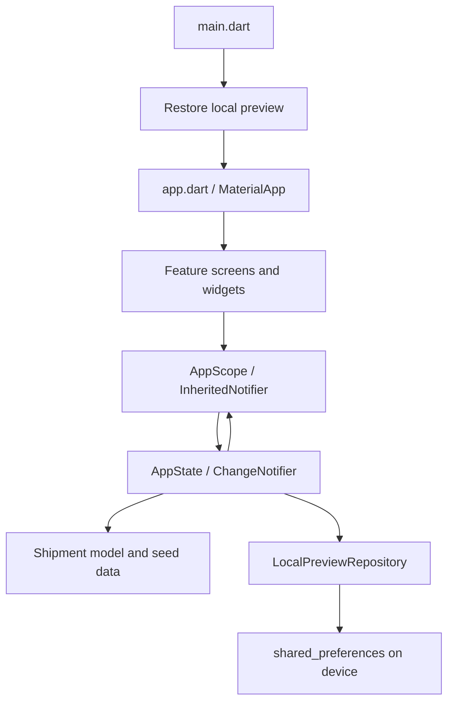
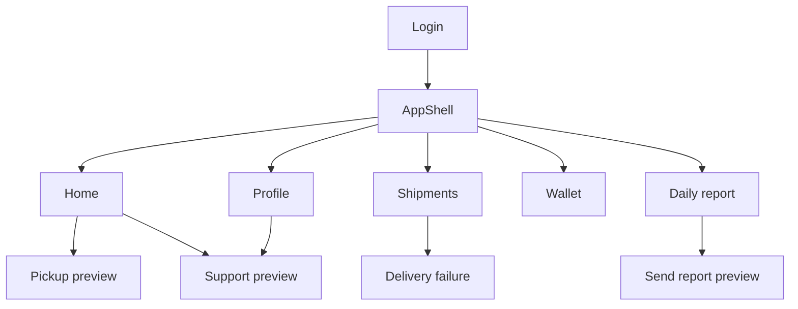

# Future Express — architecture and application flow

This document describes the code in this repository. The current product is a **courier UI preview** based on the [Future Express Figma file](https://www.figma.com/design/jBbYSrD2drww71I7t1oxXQ/Future-expressapp?node-id=0-1). It implements one local courier workflow. There is no service-provider app, REST API, Cubit, Dio, GetIt, Hive, Firebase, real authentication, or real scanner in this codebase. These may be future integrations; they are not current dependencies.

## Runtime architecture

`AppState` is the single source of truth for the current UI. A screen calls an action such as `pickupNext`, `deliver`, `fail`, `sendReport`, `setDuty`, or `toggleLanguage`. The state updates the shipment list or relevant field, notifies `AppScope` listeners, and queues a snapshot for local storage. Home, shipments, wallet, and reports then rebuild from the same values. This is reactive local state; it is **not** a live backend.

## Startup and navigation

1. `lib/main.dart` initializes Flutter, creates `AppState`, and awaits `restore()` before showing a screen.
2. `lib/app.dart` mounts `MaterialApp` with the shared theme, Arabic and English Material localization delegates, the persisted locale, and `AppScope`.
3. A fresh launch shows `LoginScreen`. Any nonempty phone and password enter the UI preview. The phone stays in memory for this session; the password is not retained. There is no token or server-side authentication.
4. `AppShell` holds the home, shipments, reports, wallet, and profile tabs. The home screen links to pickup and support. Shipment details link to the delivery failure form. Reports link to the send form. Profile contains the language switch and sign-out.
5. Sign-out returns to login and clears the in-memory phone; it does not delete the locally saved preview progress.

## Courier data flow

The initial records are defined in `features/shipments/data/sample_shipments.dart`. `Shipment` stores an ID, bilingual customer and address fields, customer phone, collection method, amount, and status (`pending`, `inTransit`, `delivered`, `failed`). `AppState` creates a mutable working list from those seed records and restores saved status overrides at startup.

| Action | State transition | Other screens affected |
| --- | --- | --- |
| Simulated pickup | First pending shipment → in transit; add its ID to pickup history | Home counts, shipment filters, report |
| Confirm delivery | Selected in-transit shipment → delivered | Home counts, completed filter, wallet, report and cash/online breakdown |
| Delivery failed | Pending/in-transit shipment → failed; save reason key and notes | Shipment detail, wallet pending amount, report failure count |
| Send report | Save current notes and mark report sent locally | Report send button; a later shipment change clears this flag |
| Change language | Switch `ar-SA` ↔ `en-US` | Text, Material localization, date formatting and RTL/LTR layout |

The wallet total is the sum of delivered shipment amounts. Its pending amount is the sum of pending and in-transit amounts. The report splits collected amounts by each shipment's `PaymentMethod`. These numbers are derived from the same list rather than stored as separate counters. The send action does **not** transmit a report. The pickup button simulates a QR scan; there is no camera integration.

## Storage and localization

`LocalPreviewRepository` uses `SharedPreferencesAsync` under the key `future_express_preview_v1`. It keeps language, duty status, shipment status overrides, picked-up IDs, failure reasons and notes, report notes and sent flag. Writes are queued in action order. Login credentials and the entered phone number are not persisted. The sample shipment fields remain in source code; there is no add/edit shipment form or remote synchronization. This storage is suitable for preview progress, not authoritative delivery or financial records.

`core/l10n/app_locale_key.dart` defines the `AppLocaleKey` constants. `app_strings.dart` holds parallel Arabic and English values indexed by those constants. Screens call `tr(context, AppLocaleKey.someKey)` and `app.dart` supplies the locale and Flutter localization delegates. Switching in login or profile changes the active locale and persists it locally. The supported languages are Arabic and English only.

## Source structure

| Path | Responsibility |
| --- | --- |
| `lib/main.dart` | Flutter bootstrap and restore |
| `lib/app.dart` | Root widget, theme, locale, localization delegates, app scope |
| `lib/core/state/app_state.dart` | Shared state, derived totals, workflow actions, state provider |
| `lib/core/storage/local_preview_repository.dart` | Read/write local preview snapshots |
| `lib/core/l10n/app_locale_key.dart`, `app_strings.dart` | Centralized text keys and Arabic/English values |
| `lib/core/assets/app_images.dart` | Centralized image paths used by Dart widgets |
| `lib/core/theme.dart`, `lib/core/widgets/` | Visual tokens and reusable buttons/cards/layout/currency |
| `lib/features/shipments/domain/shipment.dart` | Shipment entity and status/payment enums |
| `lib/features/shipments/data/sample_shipments.dart` | Initial demo shipment records |
| `lib/features/*/presentation/screens/` | One screen or Figma state per file |
| `lib/features/*/presentation/widgets/` | Feature-specific reusable UI |
| `assets/auth/` | Supplied Future Express logo registered in `pubspec.yaml` |
| `test/app_state_test.dart` | Local workflow and restore tests |
| `.github/workflows/flutter.yml` | Stable Flutter analyze, test and web build job |

The screen folders cover `auth`, `home`, `shipments`, `reports`, `wallet`, `profile`, `pickup`, and `support`. All twelve Figma nodes and their concrete file paths are listed in [README.md](README.md). A shipment's all/pending states have separate view files while sharing `ShipmentList`; expanded details have their own widget file.

## Current boundaries and next integrations

- Phone/password entry is a preview only. There is no authorization, role model, service-provider flow or backend endpoint.
- Support WhatsApp and call buttons explain that a real support number is needed. They do not initiate external contact.
- The repository does not include generated platform runner folders. With Flutter stable installed, run `flutter create --platforms=android,ios,web .`, `flutter pub get`, `flutter analyze`, `flutter test`, and `flutter run`. The GitHub workflow is configured to analyze, test and build web on pushes.
- A future API integration can replace `sample_shipments.dart` and `LocalPreviewRepository` behind a repository interface, then introduce an authenticated session and loading/error states. It should not treat preview amounts or local report flags as backend truth.
